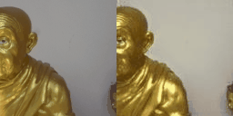
# Lighting-Swap-Cyclegan
This network is based on CycleGan(https://arxiv.org/pdf/1703.10593.pdf), with a couple small modifications to make it easy to swap lighting between sets of photos. This is the same network from my blog post: http://neuralvfx.com/lighting/lighting-swap-cyclegan/

My datasets were created by photographing the same site at two different times of day. The "Wat Mai Amataros" dataset can be downloaded here: http://neuralvfx.com/datasets/light_swap/wat_mai_amataros.rar

# Code Usage

Usage instructions found here: [user manual page](USAGE.md).

# Example Data Sets
## Wat Mai Amataros
### Sunny
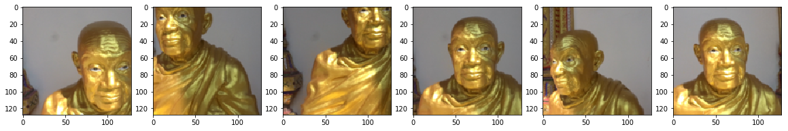
### Cloudy
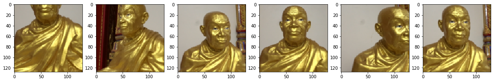
## Wat Choum Khong
### Cloudy
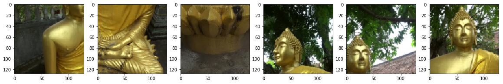
### Sunny
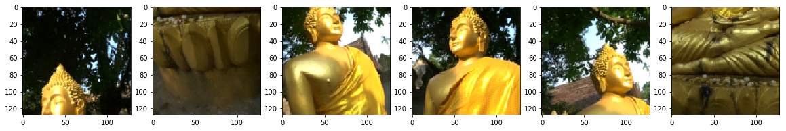

# Example Results
## Wat Mai Amataros
### Cloudy to Sunny 
#### (1: Real Cloudy Image — 2: Generated Sunny Image — 3: Real Sunny Image)
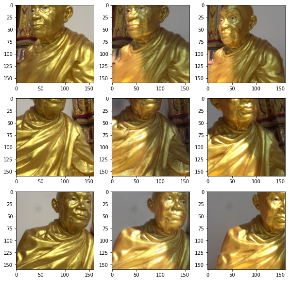
### Sunny to Cloudy
#### (1: Real Sunny Image — 2: Generated Cloudy Image — 3: Real Cloudy Image)
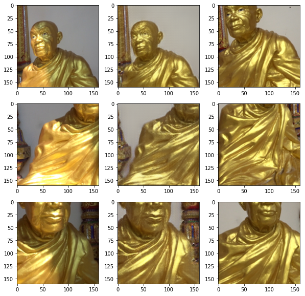
## Wat Choum Khong
### Cloudy to Sunny 
#### (1: Real Cloudy Image — 2: Generated Sunny Image — 3: Real Sunny Image)
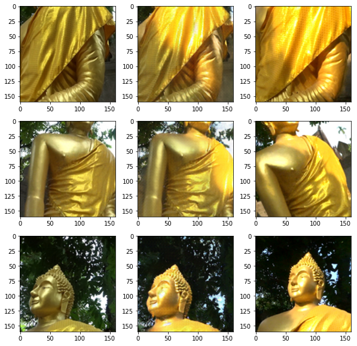
### Sunny to Cloudy 
#### (1: Real Sunny Image — 2: Generated Cloudy Image — 3: Real Cloudy Image)
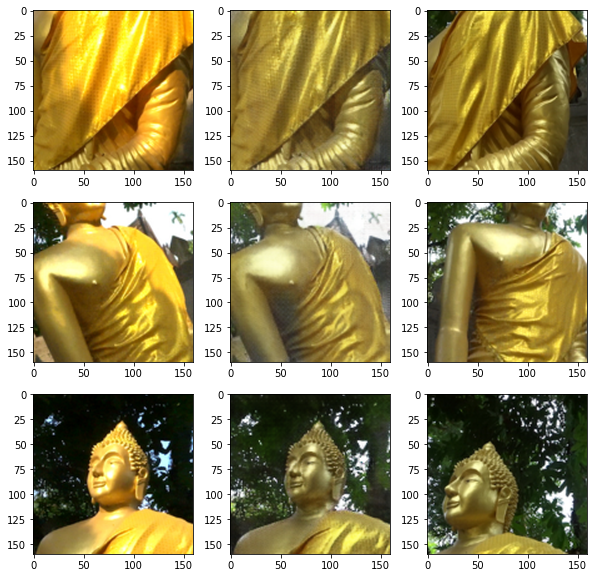

# Video Examples
## Wat Mai Amataros
### Cloudy to Sunny

### Sunny to Cloudy

## Wat Choum Khong
### Cloudy to Sunny
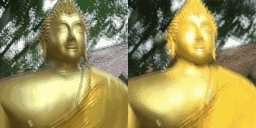
### Sunny to Cloudy
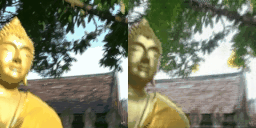
