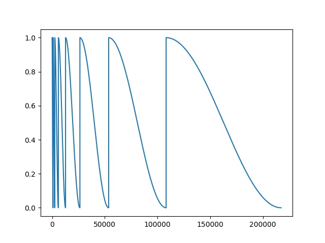
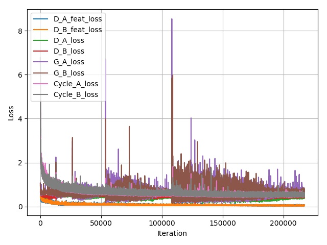
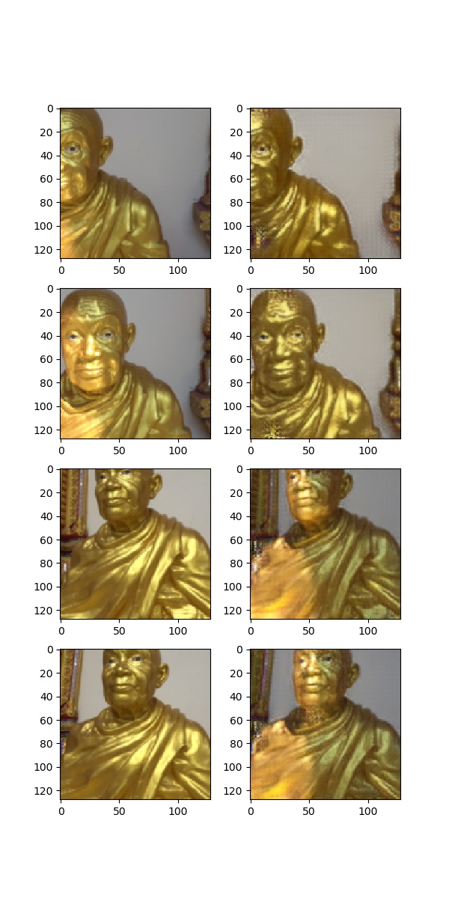

## Getting Started
- Install torch 0.3.1 and dependencies from https://github.com/torch/distro
- Install packages 'tqdm', 'PIL', 'matplotlib', 'unrar'

- Clone this repo:
```bash
git clone https://github.com/NeuralVFX/lighting-swap-cyclegan.git
cd lighting-swap-cyclegan
```
- Download the dataset (e.g. [Wat Mai Amataros](http://neuralvfx.com/datasets/light_swap/wat_mai_amataros.rar)):
```bash
bash data/get_test_dataset.sh
```
- Or try to take some photos on your own!

## Train The Model
```bash
python train.py --dataset wat_mai_amataros --train_epoch 3 --similar_distance 10  --save_root wat_mai_amataros_tain --A morning --B cloudy
```

## Continue Training Existing Saved State
```bash
python train.py --dataset wat_mai_amataros --load_state output/wat_mai_amataros_tain_3.json --train_epoch 8 --similar_distance 10  --save_root wat_mai_amataros_tain --A morning --B cloudy
```

## Command Line Arguments

```
--dataset default='wat_mai_amataros', type=str            # Dataset folder name
--train_folder', default='train', type=str                # Train folder name
--test_folder, default='test', type=str                   # Test folder name
--A', default='morning', type=str                         # First Variant folder to swap
--B', default='cloudy', type=str                          # Second Variant folder to swap
--in_channels', default=3, type=int                       # Channels in image
--batch_size, default=7, type=int                         # Training batch size
--gen_filters, default=256, type=int                      # Filter count for generators
--disc_filters, default=512, type=int                     # Filter count for discrimintors
--res_blocks, default=9, type=int                         # Res block count for generators
--img_input_size, default=270, type=int                   # Expected Image Size (Image is cropped to square size of this value in dataloader)  
--img_output_size, default=128, type=int                  # Image Training Size (Image is resized to this value in dataloader)
--lr_disc, default=1e-3, type=float                       # Learning rate for discriminator
--lr_gen, default=1e-3, type=float                        # Learning rate for generator
--train_epoch, default=5, type=int                        # Number of "warm restarts" before training completes
--lr_cycle_mult, default=2.0, type=float                  # Multiplier for number of iterations used in cosine anealing after each warm restart
--cycle_loss_A, default=10.0, type=float                  # Multiplier for cycle consistency loss for generator A
--cycle_loss_B, default=10.0, type=float                  # Multiplier for cycle consistency loss for generator B
--similar_distance, default=10, type=int                  # Maximum distance for "content pairing" between varients (If set to size of training sets then it's effectivly random, if set to 10 then a random choice from the 10 most similar images will be chosen for pairing)
--beta1, default=.5, type=float                           # Beta1 value used by optimzers
--beta2, default=.999, type=float                         # Beta2 value used by optimzers
--gen_layers, default=2, type=int                         # Count of convolution and transpose layers in generator
--disc_layers, default=3, type=int                        # Count of layers in patch discriminator
--ids_a, default=[10, 20], type=int                       # Ids which will be indexed into to generate preview images of test set A
--ids_b, default=[10, 20]), type=int                      # Ids which will be indexed into to generate preview images of test set B
--save_root, default='wat_mai_amataros_train', type=str   # Prefix for files created by the model under the /output directory
--load_state, type=str                                    # Optional: filename of state to load and resume training from
```

## Data Folder Structure

- This is the folder layout that the data is expected to be in:

`data/<data set>/<set type>/<variant>/`

- For example if you are swapping `sunny` to `cloudy` on the `wat_mai_amataros` training set:

Train Dir:

`data/wat_mai_amataros/train/sunny/`

`data/wat_mai_amataros/train/cloudy/`

Test Dir:

`data/wat_mai_amataros/test/sunny/`

`data/wat_mai_amataros/test/cloudy/`

## Output Folder Structure

- `weights`, `test images`, `loss graph` and `learning rate graph`, are all output to this directory: `output/<save_root>_*.*`

- Learning Rate Graph Example: `output/wat_mai_amataros_train_learning_rate_schedule.jpg`


- Loss Graph Example: `output/wat_mai_amataros_train_loss.jpg`


- Test Image Example (output every loop through dataset): `output/wat_mai_amataros_train_255.jpg`


## Other Notes

- This network is using `Warm Restarts` https://arxiv.org/pdf/1608.03983 , every `train_epoch` is a warm restart

- This network uses a resnet to gather latent vectors of every image in the training set, this is used to measure content similarity between `varient` sets

- The content similarity is stored as a cache, and then the `similar_distance` is used to randomly select similar images between the two sets

- The features of the discriminator are used in an additional loss function, this penalizes the difference in mean and standard deviation between real and fake images (of similar content)

- I notice that on occasion, training gets off to a bad start and just learns to invert the image. It's good to check the first couple epochs output images to ensure that you don't waste days training an image inverter!
